<!-- TODO:  -->

# targets-spatsoc-intragroup-dynamics

A template [`targets`](https://github.com/ropensci/targets) workflow for
measuring intragroup social dynamics from GPS data with
[`spatsoc`](https://github.com/ropensci/spatsoc/).

``` mermaid
graph LR
  style Legend fill:#FFFFFF00,stroke:#000000;
  style Graph fill:#FFFFFF00,stroke:#000000;
  subgraph Legend
    xf1522833a4d242c5(["Up to date"]):::uptodate
    xbecb13963f49e50b{{"Object"}}:::none
    xeb2d7cac8a1ce544>"Function"]:::none
    xd03d7c7dd2ddda2b(["Regular target"]):::none
  end
  subgraph Graph
    direction LR
    x11880ed5069abb8c(["id_fusions<br>fusion_id()"]):::uptodate --> x3beb570a7cf0e1dc(["delay_edges<br>edge_delay()"]):::uptodate
    xc25194a2e4c760d5{{"id"}}:::uptodate --> x3beb570a7cf0e1dc(["delay_edges<br>edge_delay()"]):::uptodate
    x346d09d418e9b158(["step_directions"]):::uptodate --> x3beb570a7cf0e1dc(["delay_edges<br>edge_delay()"]):::uptodate
    xe40cf9885b1e2908{{"window"}}:::uptodate --> x3beb570a7cf0e1dc(["delay_edges<br>edge_delay()"]):::uptodate
    xb817b55e688fdfc3(["group_direction_leaders<br>leader_direction_group()"]):::uptodate --> x82786d09c0fcc8be(["direction_to_group_dir_leaders<br>direction_to_leader()"]):::uptodate
    xbd740468b493bf05{{"coords"}}:::uptodate --> x82786d09c0fcc8be(["direction_to_group_dir_leaders<br>direction_to_leader()"]):::uptodate
    xa16877b1adca734b{{"fillNA"}}:::uptodate --> x365b64b036e1db58(["distance_edges<br>edge_dist()"]):::uptodate
    xbd740468b493bf05{{"coords"}}:::uptodate --> x365b64b036e1db58(["distance_edges<br>edge_dist()"]):::uptodate
    x346d09d418e9b158(["step_directions"]):::uptodate --> x365b64b036e1db58(["distance_edges<br>edge_dist()"]):::uptodate
    x86be964788bf0a62{{"spatial_threshold"}}:::uptodate --> x365b64b036e1db58(["distance_edges<br>edge_dist()"]):::uptodate
    x1a924ae7f0a51246{{"timegroup"}}:::uptodate --> x365b64b036e1db58(["distance_edges<br>edge_dist()"]):::uptodate
    x7be2e81b00311cea{{"returnDist"}}:::uptodate --> x365b64b036e1db58(["distance_edges<br>edge_dist()"]):::uptodate
    xc25194a2e4c760d5{{"id"}}:::uptodate --> x365b64b036e1db58(["distance_edges<br>edge_dist()"]):::uptodate
    xbd740468b493bf05{{"coords"}}:::uptodate --> xa036b69b269981da(["distance_to_group_dir_leaders<br>distance_to_leader()"]):::uptodate
    xb817b55e688fdfc3(["group_direction_leaders<br>leader_direction_group()"]):::uptodate --> xa036b69b269981da(["distance_to_group_dir_leaders<br>distance_to_leader()"]):::uptodate
    xc25194a2e4c760d5{{"id"}}:::uptodate --> x884798be03ef20d0(["dyad_centroids<br>centroid_dyad()"]):::uptodate
    xd1855d56aaab0158(["id_dyads<br>dyad_id()"]):::uptodate --> x884798be03ef20d0(["dyad_centroids<br>centroid_dyad()"]):::uptodate
    x788f41fdc4e37558(["spatial_groups<br>group_pts()"]):::uptodate --> x884798be03ef20d0(["dyad_centroids<br>centroid_dyad()"]):::uptodate
    xbd740468b493bf05{{"coords"}}:::uptodate --> x884798be03ef20d0(["dyad_centroids<br>centroid_dyad()"]):::uptodate
    x3beb570a7cf0e1dc(["delay_edges<br>edge_delay()"]):::uptodate --> x994414e4774e3751(["edge_delay_leaders<br>leader_edge_delay()"]):::uptodate
    x788f41fdc4e37558(["spatial_groups<br>group_pts()"]):::uptodate --> x25d985acde8f25cc(["fusion_centroids<br>centroid_fusion()"]):::uptodate
    xc25194a2e4c760d5{{"id"}}:::uptodate --> x25d985acde8f25cc(["fusion_centroids<br>centroid_fusion()"]):::uptodate
    xbd740468b493bf05{{"coords"}}:::uptodate --> x25d985acde8f25cc(["fusion_centroids<br>centroid_fusion()"]):::uptodate
    x11880ed5069abb8c(["id_fusions<br>fusion_id()"]):::uptodate --> x25d985acde8f25cc(["fusion_centroids<br>centroid_fusion()"]):::uptodate
    xbd740468b493bf05{{"coords"}}:::uptodate --> x6ba603f6e8293383(["group_centroids<br>centroid_group()"]):::uptodate
    x1073df0072bfb123(["group_directions<br>direction_group()"]):::uptodate --> x6ba603f6e8293383(["group_centroids<br>centroid_group()"]):::uptodate
    xbd740468b493bf05{{"coords"}}:::uptodate --> xb817b55e688fdfc3(["group_direction_leaders<br>leader_direction_group()"]):::uptodate
    x6ba603f6e8293383(["group_centroids<br>centroid_group()"]):::uptodate --> xb817b55e688fdfc3(["group_direction_leaders<br>leader_direction_group()"]):::uptodate
    x346d09d418e9b158(["step_directions"]):::uptodate --> x1073df0072bfb123(["group_directions<br>direction_group()"]):::uptodate
    x3f91b11005001951{{"id2"}}:::uptodate --> xd1855d56aaab0158(["id_dyads<br>dyad_id()"]):::uptodate
    x365b64b036e1db58(["distance_edges<br>edge_dist()"]):::uptodate --> xd1855d56aaab0158(["id_dyads<br>dyad_id()"]):::uptodate
    x516429c313e0db0a{{"id1"}}:::uptodate --> xd1855d56aaab0158(["id_dyads<br>dyad_id()"]):::uptodate
    x925c0ddb7f99c4a5{{"allow_split"}}:::uptodate --> x11880ed5069abb8c(["id_fusions<br>fusion_id()"]):::uptodate
    xd1855d56aaab0158(["id_dyads<br>dyad_id()"]):::uptodate --> x11880ed5069abb8c(["id_fusions<br>fusion_id()"]):::uptodate
    x86be964788bf0a62{{"spatial_threshold"}}:::uptodate --> x11880ed5069abb8c(["id_fusions<br>fusion_id()"]):::uptodate
    x073b67df0dc1a8ce{{"n_min_length"}}:::uptodate --> x11880ed5069abb8c(["id_fusions<br>fusion_id()"]):::uptodate
    x96ee942bed2f2986{{"n_max_missing"}}:::uptodate --> x11880ed5069abb8c(["id_fusions<br>fusion_id()"]):::uptodate
    x251c0fecf340765b{{"filepath"}}:::uptodate --> x769da6568e9cd872(["input_data<br>fread(filepath)"]):::uptodate
    x346d09d418e9b158(["step_directions"]):::uptodate --> x834929c790cf2d7b(["polarization<br>direction_polarization()"]):::uptodate
    xe1070fbd6d46a47b{{"datetime"}}:::uptodate --> x74f74fb4673261e6(["prepared_dates<br>prep_dates()"]):::uptodate
    xd135a9eb46727432>"prep_dates"]:::uptodate --> x74f74fb4673261e6(["prepared_dates<br>prep_dates()"]):::uptodate
    x769da6568e9cd872(["input_data<br>fread(filepath)"]):::uptodate --> x74f74fb4673261e6(["prepared_dates<br>prep_dates()"]):::uptodate
    x1faf6e798011c143(["temporal_groups<br>group_times()"]):::uptodate --> x788f41fdc4e37558(["spatial_groups<br>group_pts()"]):::uptodate
    x1a924ae7f0a51246{{"timegroup"}}:::uptodate --> x788f41fdc4e37558(["spatial_groups<br>group_pts()"]):::uptodate
    xbd740468b493bf05{{"coords"}}:::uptodate --> x788f41fdc4e37558(["spatial_groups<br>group_pts()"]):::uptodate
    x86be964788bf0a62{{"spatial_threshold"}}:::uptodate --> x788f41fdc4e37558(["spatial_groups<br>group_pts()"]):::uptodate
    xc25194a2e4c760d5{{"id"}}:::uptodate --> x788f41fdc4e37558(["spatial_groups<br>group_pts()"]):::uptodate
    xbd740468b493bf05{{"coords"}}:::uptodate --> x346d09d418e9b158(["step_directions"]):::uptodate
    x077cfe721406740b{{"projection"}}:::uptodate --> x346d09d418e9b158(["step_directions"]):::uptodate
    x788f41fdc4e37558(["spatial_groups<br>group_pts()"]):::uptodate --> x346d09d418e9b158(["step_directions"]):::uptodate
    xc25194a2e4c760d5{{"id"}}:::uptodate --> x346d09d418e9b158(["step_directions"]):::uptodate
    xe1070fbd6d46a47b{{"datetime"}}:::uptodate --> x1faf6e798011c143(["temporal_groups<br>group_times()"]):::uptodate
    x7691bca923fa768d{{"temporal_threshold"}}:::uptodate --> x1faf6e798011c143(["temporal_groups<br>group_times()"]):::uptodate
    x74f74fb4673261e6(["prepared_dates<br>prep_dates()"]):::uptodate --> x1faf6e798011c143(["temporal_groups<br>group_times()"]):::uptodate
    xfeaff7c1bc5fe2e5{{"group"}}:::uptodate
  end
  classDef uptodate stroke:#000000,color:#ffffff,fill:#354823;
  classDef none stroke:#000000,color:#000000,fill:#94a4ac;
```

## Usage

1.  Clone/fork/download/etc make your own copy somewhere!
2.  Add your data to the input folder (and remove the example data)
3.  Open `_targets.R`
4.  Change the global variables in the Variables section
5.  Run `targets::tar_make()`

## Resources

- {spatsoc}
  - <https://docs.ropensci.org/spatsoc/>
- {targets}
  - <https://docs.ropensci.org/targets>
  - <https://books.ropensci.org/targets>
